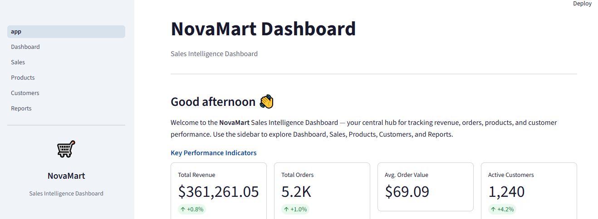
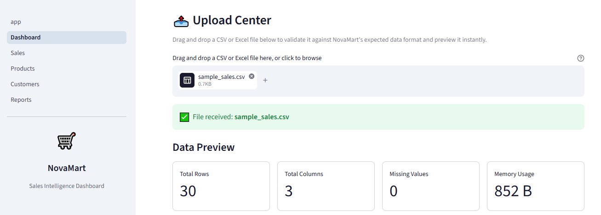
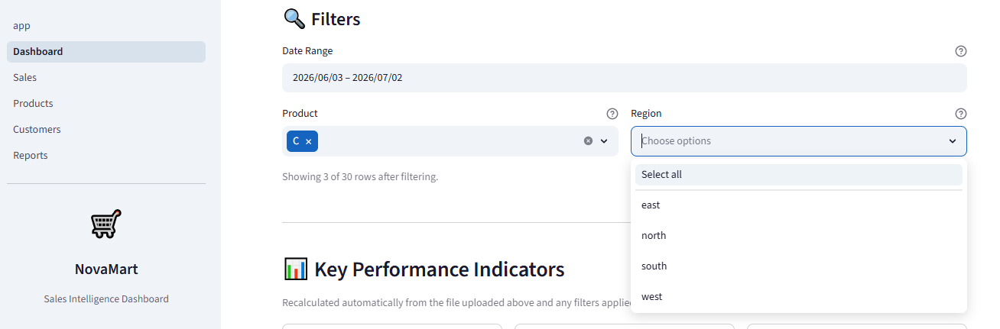
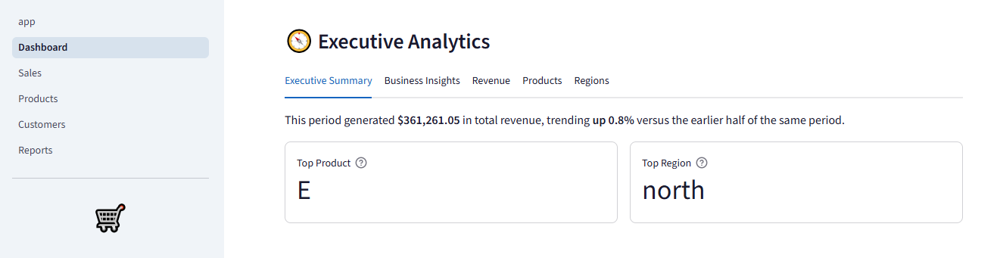
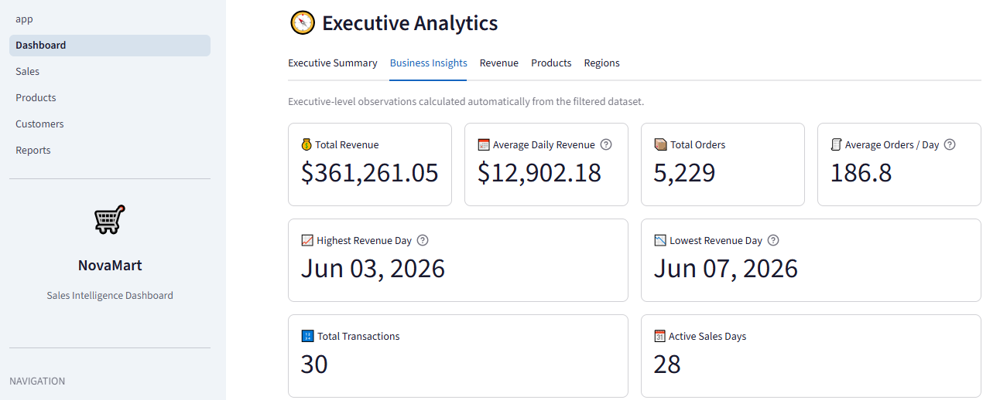

# 📊 NovaMart Sales Dashboard

> **A professional Business Intelligence Dashboard built with Python, Streamlit and Plotly.**

NovaMart transforms raw sales data into interactive dashboards, executive analytics and business insights through a clean, modular and scalable architecture.

---

## 🚀 Project Overview

NovaMart is a portfolio-grade Business Intelligence application designed to demonstrate professional software engineering practices while delivering meaningful sales analytics.

Users can upload CSV or Excel files and instantly explore their business through dynamic KPIs, interactive filters, executive analytics and automated business insights.

---

## ✨ Features

### 📂 Data Management

- ✅ CSV Upload
- ✅ Excel Upload
- ✅ Automatic Data Validation
- ✅ Error Handling
- ✅ Missing Value Processing

### 📊 Analytics

- ✅ Dynamic KPI Engine
- ✅ Executive Analytics
- ✅ Revenue Analysis
- ✅ Product Analysis
- ✅ Regional Analysis
- ✅ Business Insights

### 🎛 Interactive Dashboard

- ✅ Global Filters
- ✅ Dynamic Charts
- ✅ Responsive KPI Cards
- ✅ Real-time Updates

### 🏗 Software Engineering

- ✅ Modular Architecture
- ✅ Reusable Components
- ✅ Separation of Concerns
- ✅ Automated Testing
- ✅ Git Version Control
- ✅ AI-assisted Development Workflow

---

## 🏗 Architecture

```
CSV / Excel
      │
      ▼
Upload Center
      │
      ▼
DataLoader
      │
      ▼
Filtering Engine
      │
      ▼
Analytics Layer
      │
 ┌────┴───────────┐
 ▼                ▼
KPIs      Executive Analytics
                     │
                     ▼
             Business Insights
```

---

## 📁 Project Structure

```
NovaMart_Sales_Dashboard/

├── assets/
├── components/
│   ├── analytics/
│   ├── footer.py
│   ├── header.py
│   ├── kpi_cards.py
│   ├── sidebar.py
│   └── upload_center.py
│
├── config/
├── data/
├── docs/
├── pages/
├── tests/
├── utils/
│
├── app.py
├── requirements.txt
└── README.md
```

---

## 📸 Screenshots

### 🏠 Home Page



---

### 📊 Dashboard Overview



---

### 🎛 Interactive Filters



---

### 📈 Executive Analytics



---

### 💡 Business Insights



## ⚙ Technology Stack

| Category | Technology |
|-----------|------------|
| Language | Python |
| Framework | Streamlit |
| Visualization | Plotly |
| Data Processing | Pandas |
| Excel Support | OpenPyXL |
| Testing | Pytest |
| Version Control | Git |
| Repository | GitHub |

---

## 🚀 Installation

Clone the repository

```bash
git clone https://github.com/shahzad14285/novamart-sales-dashboard.git
```

Move into the project

```bash
cd novamart-sales-dashboard
```

Install dependencies

```bash
pip install -r requirements.txt
```

Run the application

```bash
streamlit run app.py
```

---

## 📂 Supported Dataset Format

Current required columns:

| Column | Required |
|----------|---------|
| date | ✅ |
| revenue | ✅ |
| orders | ✅ |

Optional columns:

- product
- customer
- region

NovaMart automatically detects optional columns and enables related analytics dynamically.

---

## 📊 Dashboard Modules

- Home
- Dashboard
- Sales Analytics
- Customers
- Products
- Settings

---

## 🧪 Testing

NovaMart includes both automated and manual testing.

### Automated

- Data Loader Tests
- Filter Engine Tests
- Analytics Tests
- Business Insights Tests

### Manual

- Upload Validation
- KPI Verification
- Filter Testing
- Regression Testing

---

## 📈 Current Development Progress

| Sprint | Status |
|----------|--------|
| Project Planning | ✅ |
| Architecture | ✅ |
| Foundation | ✅ |
| Upload Center | ✅ |
| Dynamic KPIs | ✅ |
| Interactive Filters | ✅ |
| Executive Analytics | ✅ |
| Business Insights | ✅ |
| Export Center | 🔄 |
| Performance Optimization | 🔄 |
| Deployment | ⏳ |

---

## 🛣 Roadmap

### Version 0.3

- Export Center
- Excel Export
- CSV Export

### Version 0.4

- Performance Improvements
- UI Polish
- Better Caching

### Version 0.5

- Cloud Deployment

### Version 1.0

Production-ready Business Intelligence Dashboard

---

## 🤖 AI-Assisted Development

NovaMart is developed using a modern AI-assisted engineering workflow.

Development combines:

- ChatGPT
- Claude Code
- Git
- GitHub
- Manual Testing
- Modular Software Architecture

Every feature is planned, implemented, tested, documented and version-controlled.

---

## 👨‍💻 Author

**Shahzad**

Portfolio Project — Business Intelligence Dashboard

---

## 📄 License

This project is intended for educational and portfolio purposes